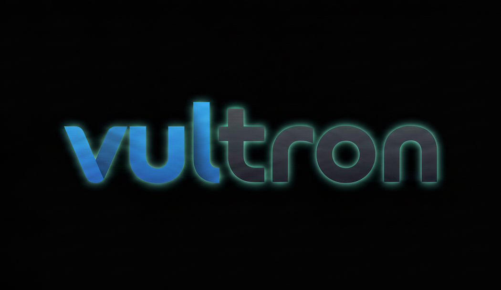

<p align="center">
  
</p>

# Vultron (Kalsarikännit)

**Vultron** to NIEzaawansowana integracja Home Assistant z systemem dziennika elektronicznego **EduVulcan**. Dodatek został zaprojektowany, aby dostarczać rodzicom i uczniom kluczowe informacje o edukacji w sposób przejrzysty, zautomatyzowany i bezpieczny.

**Autor:** Tomasz H. i pare AI 
**Wersja:** 1.0  
**Nazwa Kodowa:** Kalsarikännit 🚀

---

## ✨ Główne Funkcje

- 👨‍👩‍👧‍👦 **Multi-Student Support:** Automatyczne wykrywanie wszystkich dzieci przypisanych do konta rodzica. Każde dziecko otrzymuje własny zestaw sensorów (np. `adam_nowak`, `jan_kowalski`).
- 📅 **Profesjonalny Plan Lekcji:** Klasyczny układ tabelaryczny z nieograniczoną nawigacją tygodniową (poprzedni / obecny / następny).
- 📈 **Monitoring Ocen:** Śledzenie ocen cząstkowych z systemem powiadomień o nowych wpisach i zmianach.
- 🎒 **Terminarz Wydarzeń:** Podgląd sprawdzianów, kartkówek i zadań domowych z kolorystycznym rozróżnieniem priorytetów.
- 🛠️ **Zero-Click UI:** Dodatek automatycznie rejestruje wymagane karty JavaScript w zasobach Lovelace (Resources) przy każdym starcie.
- 🕵️ **System Anty-Detekcyjny:** 
  - Zapytania do serwerów Vulcan wysyłane są w losowych odstępach (40-60 min).
  - **Tryb Nocny:** Całkowite wstrzymanie aktywności bota między 01:00 a 05:59.
- 📝 **Precyzyjne Logowanie:** Wszystkie zdarzenia logowane są z timestampem w formacie `[YYYY-MM-DD HH:MM:SS]`.

---

## 🏗️ Architektura Systemu

System opiera się na modularnej strukturze współpracujących skryptów:

| Moduł | Rola | Opis techniczny |
| :--- | :--- | :--- |
| `vul.py` | 🔑 **Logowanie** | Silnik **Selenium Headless**. Obsługuje logowanie, akceptację cookies (iframe) oraz ekstrakcję unikalnych kluczy sesji (`app_key`) bezpośrednio z nowego Panelu Rodzica. |
| `vulo.py` | 📝 **Oceny** | Pobiera oceny i zarządza bazą **SQLite** (`vultron.db`), porównując stany w celu wykrycia nowych ocen. |
| `vulp.py` | 📅 **Plan Lekcji** | Synchronizuje plan zajęć w szerokim zakresie dat, wspierając nawigację w kartach UI. |
| `vuls.py` | 🎒 **Zadania** | Pobiera szczegółowe informacje o sprawdzianach i zadaniach domowych (detale nauczyciela, opisy). |
| `setup_ui.py` | 🎨 **UI Setup** | Automatycznie dodaje karty do zasobów HA przez **WebSocket API**, eliminując konfigurację ręczną. |
| `run.sh` | ⚙️ **Orkiestrator** | Skrypt nadrzędny Bash. Zarządza pętlą czasu, kopiowaniem plików UI i anty-detekcją. |

---

## 🚀 Instalacja i Konfiguracja

1. Skopiuj pliki dodatku do folderu `/addons/vultron` w swojej instalacji Home Assistant.
2. W interfejsie HA przejdź do **Ustawienia -> Dodatki -> Sklep z dodatkami**, kliknij trzy kropki i wybierz **Odśwież**.
3. Zainstaluj dodatek **Vultron**.
4. W zakładce **Konfiguracja** wypełnij dane dostępowe:

| Parametr | Opis | Przykład |
| :--- | :--- | :--- |
| `city_slug` | Nazwa miasta z adresu URL dziennika | `radom` |
| `username` | Adres e-mail do EduVulcan | `rodzic@email.pl` |
| `password` | Hasło do portalu | `TwojeTajneHaslo` |
| `period_id` | ID semestru (np. z Narzędzi Deweloperskich) | `40732` |

5. Uruchom dodatek.

---

## 📊 Konfiguracja Kart Dashboardu

Po uruchomieniu dodatku sensory zostaną utworzone automatycznie (np. `sensor.vultron_oceny_jan_kowalski`). Dodaj nową kartę (Manual Card) na swoim Dashboardzie, korzystając z poniższych wzorów:

### 📅 Plan Lekcji (Tabelaryczny z nawigacją)
```yaml
type: custom:vultron-card
entity: sensor.vultron_plan_jan_kowalski
```

### 📈 Oceny Cząstkowe
```yaml
type: custom:vultron-grades-card
entity: sensor.vultron_oceny_jak_kowalski
```

### 🎒 Terminarz (Sprawdziany i Zadania)
```yaml
type: custom:vultron-work-card
entity: sensor.vultron_terminarz_jan_kowalski
```

### ⚠️ Debugowanie
Jeśli napotkasz problemy z logowaniem:
1. Sprawdź zakładkę **Logi** dodatku. Wszystkie błędy są tam opisywane w czasie rzeczywistym.
2. Dodatek zapisuje zrzut ekranu ostatniego błędu logowania. Możesz go podejrzeć pod adresem:
   `http://TWOJE-IP-HA:8123/local/vultron/error.png`

### ⚖️ Nota prawna
> [!IMPORTANT]
> Projekt **Vultron** jest narzędziem edukacyjnym i służy wyłącznie do użytku prywatnego. Autor nie bierze odpowiedzialności za ewentualne blokady kont, błędy w synchronizacji danych czy inne konsekwencje wynikające z automatyzacji dostępu do portalu EduVulcan. Korzystasz z dodatku na własną odpowiedzialność.

