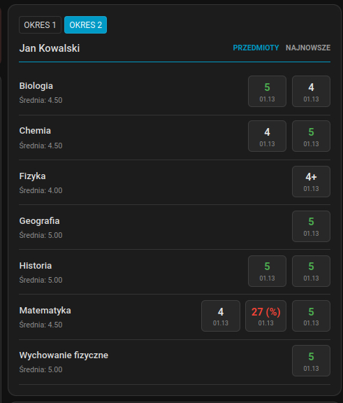
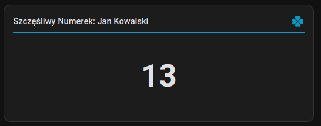

[](https://my.home-assistant.io/redirect/supervisor_add_addon_repository/?repository_url=https%3A%2F%2Fgithub.com%2Fhtomasz%2Fvultron)


[](https://github.dev/htomasz/vultron)

<p align="center">
  
<br><b>Używanie projektu jest jawnym łamaniem regulaminu EduVulcan.pl. <br>Nie rób tego.</b>
</p>

# Vultron (Friedman Unit)

**Vultron** to **totalnieNIEzaawansowana** integracja Home Assistant z systemem dziennika elektronicznego **EduVulcan.pl**. Dodatek został zaprojektowany, aby dostarczać rodzicom i uczniom kluczowe informacje o edukacji w sposób przejrzysty, zautomatyzowany i bezpieczny.

**Autor:** AI i Tomasz H. \
**Wersja:** 7.0 \
**Nazwa Kodowa:** Friedman Unit (FU) 🕐🇺🇸💣🇮🇶

# 📖 Spis treści
* [🚨 Achtung](#-achtung-achtung-)
* [🧩 Changelog](#-changelog)
* [✨ Główne Funkcje](#-główne-funkcje)
* [🏗️ Architektura Systemu](#️-architektura-systemu)
* [🚀 Instalacja](#-instalacja)
* [⚙️ Konfiguracja](#️-konfiguracja)
* [📊 Konfiguracja Kart Dashboardu](#-konfiguracja-kart-dashboardu)
* [🔄 Automatyzacja](#-automatyzacja)
* [🔍 Monitoring](#-monitoring)
* [📸 Próbki/screenshoty](#-próbkiscreenshoty)
* [🪲 Zgłaszanie błędów](#-zgłaszanie-błędów-i-bezpieczeństwo)
* [🗑️ Odinstalowanie](#️-odinstalowanie)
* [⚖️ Nota prawna](#️-nota-prawna)


## 🚨🚨🚨 Achtung Achtung 🚨🚨🚨
**Przy pierwszym uruchomieniu ZALECANE śledzenie zakładki LOGI**
czy proces logowania przechodzi poprawnie.

**W razie błędów skrypt SAMOCZYNNIE zabije kontener.**

**Przed ponownym startem:**
Sprawdź ręcznie logowanie w oryginalnym dzienniku przez W W W.

## 🧩 Changelog

<details>
<summary><b>7.0 - Friedman Unit (FU) 🕐🇺🇸💣🇮🇶</b></summary>

- Nowości
    - Przejście na Playwright — skrypt całkowicie porzuca przestarzałe Selenium. Logowanie do e-dziennika jest teraz błyskawiczne, lżejsze dla procesora i stabilniejsze.
    - Wsparcie dla Raspberry Pi (ARM) — odcięcie ciężkich zależności Selenium i przejście na lekkie systemowe Chromium odchudza kontener. Działa płynnie na słabszym sprzęcie (RPi 3/4).
    - Tryb Stealth (Anty-Bot) — dodano maskowanie przeglądarki: fałszowanie modelu karty graficznej (WebGL), wtyczek, szumu audio i ukrycie flagi webdriver. Vulcan nie rozpozna skryptu jako bota.

- Poprawki
    - SQLite „database is locked" — całkowicie wyeliminowano problem wysypujących się błędów bazy. Zapis encji i cache'u jest teraz prawidłowo kolejkowany przez dedykowane locki (asyncio.Lock + threading.Lock) oraz tryb WAL.
    - Wycieki pamięci — przeglądarka i pliki tymczasowe są bezwzględnie zamykane po każdym cyklu pobierania w bloku finally; brak procesów-zombie.
    - Logowanie do wiadomości — naprawiono obsługę linków względnych przy klikaniu w kafelek dziennika oraz błędy ze starymi ciasteczkami po poprzedniej wersji (Selenium).
    - Naprawiono błąd składni JS w module stealth (# noqa w stringu). Zaktualizowano User-Agent do Chrome/145. Poprawiono kolejność zapisu cache – tylko po sukcesie HTTP. Zastąpiono dict.clear() właściwym LRU (OrderedDict + popitem). Naprawiono race condition i ciche błędy w check_and_restore. Dodano walidację kredencjałów przy starcie.
    - Poprawki stylu kodu zgodnie z PEP8.

</details>

<details>
<summary><b>6.1 - Smoot</b></summary>

- Nowości (New Features)
    - Tryb testowy (test_mode): Dodano nowy przełącznik w konfiguracji dodatku (config.yaml). Jego włączenie całkowicie wyłącza nocne oraz weekendowe blokady harmonogramu. Skrypt w trybie testowym działa w trybie ciągłym, co ułatwia i przyspiesza testowanie wprowadzanych zmian.
    - Informacja o klasie ucznia: Skrypt podczas logowania pobiera teraz z systemu Vulcan informację o oddziale/klasie ucznia (np. "8a", "3c") i zapisuje ją w wewnętrznej strukturze danych (przygotowanie bazy pod przyszłe, specyficzne dla roczników funkcje).
    - Obsługa ocen literowych (Klasy 1-3): Karta Lovelace w Home Assistant w pełni wspiera teraz wyświetlanie ocen literowych. Dodano odpowiednie formatowanie kolorystyczne: oceny A/B (zielony), C/D (pomarańczowy), E/F (czerwony) oraz % (niebieski) i NB (szary).
    - Frekwencja - Dodano możliwość filtrowania statystyk frekwencji według przedmiotu. Skrypt pobiera teraz listę przedmiotów z /api/Przedmioty oraz statystyki dla każdego z nich równolegle przez asyncio.gather. Zamiast pakować wszystko do jednej encji (limit 16 000 B), tworzone są osobne małe encje sensor.vultron_stats_{slug}_{przedmiot} — encja główna przechowuje tylko lekki spis przedmiotów. Przedmioty bez statystyk (podsumowanie=null) są cicho pomijane na poziomie DEBUG. Karta HA dostała dropdown do wyboru przedmiotu, który przełącza się między encjami lokalnie bez żadnych dodatkowych requestów.

- Poprawki (Bug Fixes)
    - Przeniesienie logiki obliczeniowej na Backend: Karta interfejsu (JavaScript) nie wylicza już średniej ocen samodzielnie. Od teraz pobiera ona gotową, precyzyjnie wyliczoną średnią prosto z atrybutów sensora dostarczanego przez skrypt Pythona.
    - Inteligentne wyliczanie średniej: Naprawiono błąd, który powodował, że duże wartości liczbowe wpisane bez znaku procenta (np. punkty ze sprawdzianu: "60", "68") były błędnie wykrywane jako ocena celująca (6) i wliczane do średniej.
    - Nowy algorytm wyliczania średniej jest wysoce rygorystyczny: szuka wyłącznie samodzielnych cyfr od 1 do 6 z opcjonalnymi znakami (+, -, lub .5).
    - Wszystkie litery (A-F), statusy (NB, np, bz), wartości procentowe (%) oraz liczby dwu- i trzycyfrowe (np. "60", "100") są całkowicie ignorowane przy liczeniu średniej. Zignorowanie wartości przy średniej nie wpływa na jej pobieranie – każda wpisana ocena/punkty nadal wyświetla się na karcie ucznia w oryginalnej formie.
    - Aktualizacja wszystkich kart vultron‑* po serii poprawek optymalizacyjnych i porządkowych.
        - Zmiany techniczne:
            - Dodano mechanizmy cache i early return ograniczające niepotrzebne rerendery (szczególnie w kartach stats, plan, numerek).
            - Wprowadzono jednolite zarządzanie event listenerami z czyszczeniem zasobów w disconnectedCallback() – brak duplikatów i wycieków pamięci.
            - Karta planu lekcji (vultron‑card.js) czyści teraz poprawnie aktywny timer linii czasu.
            - Utrzymano pełną zgodność wizualną – brak zmian w wyglądzie, CSS i strukturze HTML.
        - Efekt dla użytkownika:
            - Szybsze działanie i mniejsze obciążenie interfejsu.
            - Stabilne sortowanie i filtrowanie w kartach z listami.
            - Brak znikających lub duplikujących się przycisków po aktualizacji stanu Home Assistanta.
- Kron :D
    - Dni Robocze: Zachowano działanie 40-60 min pomiędzy cyklami z cichą przerwą na sen od 01:00 do 05:59. Zawsze budzi się o 06:00.
    - Soboty i Niedziele: Skrypt patrzy na to, o jakiej godzinie skończył procesowanie i "budzi się" dopiero punktualnie na sztywnych godzinach (z dokładnością do minuty).
    - Przejście Dni: Jeśli skończy zadanie w niedzielę po 20:00, automatycznie uśpi się aż do poniedziałku do 06:00 rano.
    - Odporność na Restart Skryptu: Jeśli wyłączysz i włączysz wtyczkę w Home Assistant np. w sobotę o godzinie 11:00, skrypt nie zacznie agresywnie pobierać danych od razu - rozpozna, że nie nadszedł jego czas i po cichu poczeka do 16:00 z pierwszym startem. Zależnie od godziny dostosuje się z automatu do grafiku.
    - Poniedziałek – Piątek \
    | 00:00 – 05:59 | 🔴 Przerwa nocna (śpi do 06:00) \
    | 06:00 – 23:59 | 🟢 Aktywny — cykle co ~40–60 min (losowy interwał)
    - Sobota \
    | 00:00 – 07:59 | 🔴 Czeka do 08:00 | \
    | 08:00 – 08:59 | 🟢 Cykl | \
    | 09:00 – 15:59 | 🔴 Czeka do 16:00 | \
    | 16:00 – 16:59 | 🟢 Cykl | \
    | 17:00 – 22:59 | 🔴 Czeka do 23:00 | \
    | 23:00 – 23:59 | 🟢 Cykl |
    - Niedziela \
    | 00:00 – 07:59 | 🔴 Czeka do 08:00 | \
    | 08:00 – 08:59 | 🟢 Cykl | \
    | 09:00 – 11:59 | 🔴 Czeka do 12:00 | \
    | 12:00 – 12:59 | 🟢 Cykl | \
    | 13:00 – 19:59 | 🔴 Czeka do 20:00 | \
    | 20:00 – 20:59 | 🟢 Cykl | \
    | 21:00 – 23:59 | 🔴 Czeka do poniedziałku 06:00 | \
        - Skrypt sprawdza warunek godzinowy przez `now.hour not in (...)`, więc cykl może odpalić się w dowolnym momencie danej godziny, nie dokładnie o jej początku.
        - W trybie `test_mode` wszystkie filtry czasowe są pomijane, a interwał między cyklami wynosi również ~40–60 min.

</details>


<details>
<summary><b>6.0 - Oxgang</b></summary>

- Połączono wszystkie główne skrypty w jeden plik:
    - `vultron/vultron.py`
- Usunięto osobne pliki:
    - `vul.py`, `vulf.py`, `vulm.py`, `vulo.py`, `vulos.py`, `vulp.py`, `vuls.py`
    - `vuluw.py`, `vul-for-mess.py`, `vul-monitor.py`, `run.sh`, `setup_ui.py`
- Asynchroniczność "API": Dane pobierane równolegle – synchronizacja trwa 1–2 s zamiast kilkunastu.
    - Connection Pooling: Jedno stałe połączenie httpx.AsyncClient bez wielokrotnego handshake TLS.
    - asyncio.Lock: Ochrona przed błędem database is locked.
    - Timeouty: timeout=10s – koniec z zawieszaniem się skryptu.
    - WAL dla SQLite: Bezpieczna praca bazy przy wysokiej współbieżności.
- JSON zamiast Pickle: Eliminacja podatności RCE
- State Mirroring: Dane odtwarzane z cache natychmiast po restarcie HA.
- Delta-Sync: Aktualizacja tylko przy faktycznej zmianie danych.
- Graceful Shutdown: Bezpieczne zamknięcie przez SIGTERM/SIGINT.
- HTMLParser zamiast Regex: Precyzyjniejsze parsowanie HTML.
- Rotacja logów: Max 5 × 1 MB.
- Usunięcie requests: Cały HTTP ujednolicony na httpx.
- Zunifikowanie wygladu i działania wszystkich kart.
- Dodano poziomy debug: INFO, ERROR, DEBUG
- Zaktualizowano automatyzacje
- Gdzie wersja 5? No tam....

</details>

<details>
<summary><b>4.2 - 200kcal</b></summary>

- Skrypt Python (vulp.py) - Podział na 3 encje: Skrypt generuje teraz oddzielne sensory dla każdego dziecka:
    - sensor.vultron_plan_[slug]_prev (Tydzień poprzedni)
    - sensor.vultron_plan_[slug]_curr (Tydzień obecny)
    - sensor.vultron_plan_[slug]_next (Tydzień przyszły)
- Karta Lovelace (vultron-card.js)
    - Dynamiczne przełączanie: Karta automatycznie wykrywa bazową nazwę encji i podmienia końcówki (_curr, _prev, _next) podczas klikania strzałek.
    - Nawigacja: Wprowadzono blokadę nawigacji (zakres od -1 do +1 tygodnia), odpowiadający dostępnym danym.
- Automatyzacje HA/Node-RED
    - Multi-Trigger: Automatyzacje nasłuchują teraz jednocześnie na zmiany w tygodniu obecnym (_curr) i przyszłym (_next).
- Blueprint
    - Obsługa wielu encji: Nowa wersja pozwala wybrać listę sensorów (np. zaznaczenie obu tygodni naraz).
    - Zwiększona stabilność: Dodano sprawdzanie istnienia stanów poprzednich (old_state), co eliminuje błędy po restarcie HA.
- Karta Lovelace (vultron-grades-card.js)
    - System Obliczania Średniej
        - Widok **Przedmiotów**: Pod każdą nazwą przedmiotu pojawia się teraz automatycznie wyliczona średnia ocen (z dokładnością do dwóch miejsc po przecinku).
        - Inteligentne Filtrowanie: Algorytm bierze pod uwagę wyłącznie oceny numeryczne. Wpisy typu "np" (nieprzygotowanie), "bz" (brak zadania) czy inne adnotacje tekstowe są pomijane w obliczeniach.
        - Obsługa Ocen Złożonych:
            - Plusy i Minusy: Średnia traktuje oceny typu 4+ czy 5- jako ich bazowe wartości (4 i 5).
            - Wartości Dziesiętne: Pełne wsparcie dla ocen cząstkowych zapisanych zarówno z kropką, jak i przecinkiem (np. 4.5 lub 4,5 są liczone jako 4.5).
        - Zakres Bezpieczeństwa: System uwzględnia w średniej tylko wartości w przedziale 1-6, co zapobiega błędom w przypadku nietypowych wag lub punktacji procentowej.
    - Ulepszenia Interfejsu (UI)
        - Sub-label Średniej: Średnia jest wyświetlana subtelnym drukiem (opacity 0.6) pod nazwą przedmiotu, aby nie zaburzać czytelności głównej listy.
        - Poprawiona Kolorystyka: Udoskonalono metodę getGradeColor, dzięki czemu kolorowanie ocen (zielony dla 5-6, pomarańczowy dla 3-4, czerwony dla 1-2) działa teraz precyzyjniej przy ocenach z sufiksami.
    - Stabilność i Logika
        - Decimal Parser: Wprowadzono konwersję znaków regionalnych (zamiana , na .), co gwarantuje poprawność matematyczną w środowisku JavaScript.
        - Dynamiczne Renderowanie: Średnia pojawia się tylko wtedy, gdy w danym przedmiocie znajduje się co najmniej jedna ocena kwalifikująca się do obliczeń.

</details>

<details>
<summary><b>4.1 - 16KB</b></summary>

- **Oceny**
    - Podział Ocen: Rozbito oceny na dwie niezależne encje: _p1 (Okres 1) oraz _p2 (Okres 2).
    - vultron-grades-card (Oceny):
        - Dodano zakładki OKRES 1 i OKRES 2 w nagłówku.
        - Karta pozwala na płynne przełączanie widoku między semestrami.
- **Wiadomości**
    - Skrypt przesyła teraz do HA tylko 10 najnowszych wiadomości. Atrybut treść jest przesyłany wyłącznie dla wiadomości nieprzeczytanych. Wiadomości przeczytane zajmują teraz minimalną ilość miejsca (tylko meta-dane), a karta wyświetla informację o dostępie do pełnej treści w aplikacji EduVulcan.
    - vultron-messages-card:
        - Dodano licznik statystyk w nagłówku.
        - Dodano ramkę informacyjną dla wiadomości archiwalnych (bez treści).
- **Plan**
    - Redukcja Planu: Skrócono zakres planu przesyłanego do HA do 21 dni (poprzedni + obecny tydzień + następny), co pozwoliło zejść z ~20KB
    - vultron-card (Plan):
        - Zunifikowano wygląd nagłówka (Kolor Cyan #00bcd4, ikony MDI).
        - Reimplementowano znacznik "TERAZ" oraz podświetlenie aktywnej lekcji za pomocą box-shadow: inset (widoczne z każdej strony komórki).
- **Automatyzacje**
    - HA/Node_RED/Blueprints - zaktualizowano automatyzacje powiadamiania o ocenach
- **Monitoring**
    - (`vul-monitor.py`) sumuje rozmiary danych Vultron i raportuje szczegóły oraz ostrzeżenia, a alert włącza się, gdy dane encji przekroczą krytyczny limit 16 KB. Wszystkie przekroczenia progów WARNING(14000B) i CRITICAL(15500B) są logowane w konsoli [MONITOR].

</details>

<details>
<summary><b>4.0 - Furlong/fortnight</b></summary>

- Pełna migracja na SQLite: Dane są teraz trwałe, dostępne offline w bazie vultron.db.
- Optymalizacja płynności UI: Ograniczono przesył danych do HA do obecnego i poprzedniego tygodnia, co wyeliminowało lagi w interfejsie.
- Redukcja zasobów: Znacząco zmniejszono zużycie RAM przez Chromium (blokada obrazów/GPU) oraz wprowadzono bezpieczny zapis plików.
- Najważniejsze: kolor w planie zgadza sie z resztą

</details>

<details>
<summary><b>3.4.2 - Siriustek</b></summary>

- Dodano 5 gotowych schematów automatyzacji dla HA (Oceny, Frekwencja, Plan, Uwagi, Wiadomości).

</details>

<details>
<summary><b>3.4.1 - Siriustek</b></summary>

- Implementacja zaawansowanego skanowania bezpieczeństwa (CodeQL, Bandit, Trivy, Hadolint).
- Dodanie mechanizmu pre-commit i automatyzacji GitHub Actions.
- Optymalizacja dokumentacji i integracja z "My Home Assistant"

</details>

<details>
<summary><b>3.2 - Siriustek</b></summary>

- Automatyczne odświeżanie kart (Cache-busting): Koniec z ręcznym czyszczeniem ciasteczek i cache'u przeglądarki po aktualizacji dodatku. System automatycznie wersjonuje pliki .js.
- Auto-Discovery kart UI: Skrypt `setup_ui.py` sam wykrywa wszystkie pliki kart w folderze i rejestruje je w zasobach Lovelace.
- Inteligentny start: Dodano pętlę "retry" przy łączeniu z API Home Assistant. Jeśli system startuje po awarii prądu, dodatek cierpliwie poczeka, aż rdzeń HA będzie gotowy.
- Bezpieczna północ: Naprawiono błąd w skrypcie `run.sh`, który mógł powodować błędy w cyklu synchronizacji o godzinie 00:00.
- Optymalizacja obrazu: Przebudowano `Dockerfile` (czyszczenie cache apk, instalacja przez requirements.txt), co owocuje mniejszym i stabilniejszym kontenerem.
- Nowy system instalacji: Dodano obsługę przycisku "My Home Assistant" oraz uporządkowano dokumentację README.

</details>

<details>
<summary><b>3.000009 - Muggeseggele</b></summary>

- Dodano acziwmenety :D
    - vulos.py
    - vultron-osiagniecia-card.js
    - automatyzacji do niej nie będzie - nikt nie ma tak zajebistego dziecka
- Chyba wszystko juz mamy :P
- Wszędzie będzie Glassmorphism + ban
- Koniec rozwoju (nieeee :D)

</details>

<details>
<summary><b>2.5 - Peninkulma</b></summary>

- Dodano wyświetlanie za co ocena (po najechaniu na ocenę)
    - vulo.py - zmiany w zapisywaniu ocen
    - Dostosowano karte vultron-grades-card.js
    - Dostosowano automatyzacje Node-RED oraz HA do powiadomień o nowych ocenach
    - Dodano Glassmorphism i artretyzm

</details>

<details>
<summary><b>2.4 - Iteru</b></summary>

- Zrefactoryzowano kod dla vulp.py oraz vulf.py
- Zmieniono days=61 w vuls.py
- Naprawiono "zielonkę kreskę" zeby nie konczyła sie na czwartku.
- Dodano natywne automatyzacje dla HA
- Poprawiono automatyzacje dla Node-RED
- Zaktualizowane karte planu o ładne owalne cosie
- Dodano awaryjne zabijanie kontenera w sytuacji ze `vul.py` logowanie do portalu nie przejdzie.

</details>

<details>
<summary><b>2.3 - Sheppey</b></summary>

- Dodano automatyczne zabijanie kontenera w momencie gdy system wykryje ze nie moze sie zalogowac na strone.
- Czytanie treści wiadomości.
- Karta wiadomosci
    - Po kliknieciu mozna zobaczyć (oraz skopiować :D) treść wiadomosci.

</details>

<details>
<summary><b>2.2 - Saunakalja</b></summary>

- Karta terminarz. oceny
    - Dodano limit
- Karty *.js
    - Próba ujednolicenia wyglądu
- Dokumentacja
    - Dodano zrzuty ekranów wszystkich kart.
- Automatyzacja
    - Dodano przykładowe automatyzacje w Node-Red (dział automatyzacja)

</details>

<details>
<summary><b>2.1 - Kenno</b></summary>

- Dodano do karty planu
    - Dodano status frekwencji na danym przedmiocie w ciagu dnia (informacja pokaze sie tylko jak nauczyciel ją wprowadzi)
    - Dodano pasek pokazujacy aktualna godzine
    - Dodano inny kolor dla kolumny aktualnego dnia
- Dodano funkcje pobierania frekwencji oraz karte frekwencji lovelace
    - statystyka frekwencji od poczatku roku wraz z procentową reprezentacja

</details>

<details>
<summary><b>2.0 - Poronkusema</b></summary>

- Dodano chyba pełna obsługę multi-kinderpunkow

</details>

<details>
<summary><b>1.2.5 - नीलो चूहा</b></summary>

- Dodano sortowanie do kart
    - karta Oceny - sortowanie (date|subject)
    - karta Terminarz - sortowanie rosnąco, malejąco (desc,asc)
    - karta Uwagi - sortowanie rosnąco, malejąco (desc,asc)

</details>

<details>
<summary><b>1.2.4 - Shǎbī de Tómǎsī</b></summary>

- Karta plan - dodano podział na 2 lekcje o tej samej godzinie. Grupy albo błąd eduvulcan

</details>

<details>
<summary><b>1.2.3 - Chokochoko Mfunguo</b></summary>

- Karta plan - dodano daty do aktualnego tygodnia, oraz dane nauczycieli danego przedmiotu
- Karta oceny - dodano sortowanie
- Karta wiadomosci - dodano sortowanie oraz limit
- Karta uwagi - dodano sortowanie oraz limit

</details>

<details>
<summary><b>1.2.2 - EKEN 4K :P</b></summary>

- Dodano podswietlanie aktywnego dnia na dzienniku
- Dodano sortowanie w zadaniach domowych/sprawdzianach

</details>

<details>
<summary><b>1.2.1 - Tin short</b></summary>

- Dodano informacje o "zwolnieniu uczniów do domu"

</details>

<details>
<summary><b>1.2 - Messenger Burger</b></summary>

- Dodano obsługę
    - wiadomości i licznik nieprzeczytanych.

</details>

<details>
<summary><b>1.1 - Feedback boobs</b></summary>

- Dodano obsługę
    - uwag i pochwał

</details>

<details>
<summary><b>1.0 - First Contact</b></summary>

- Pierwsza wersja integracji z EduVulcan.
- Dodano:
    - plan lekcji
    - oceny
    - sprawdziany i zadania

</details>


## ✨ Główne Funkcje

- 👨‍👩‍👧‍👦 **Multi-Student Support:** Automatyczne wykrywanie wszystkich(wszystkie dzieci nasze są) dzieci przypisanych do konta rodzica. Każde dziecko otrzymuje własny zestaw sensorów (np. `adam_nowak`, `jan_kowalski`).
- 📅 **Profesjonalny Plan Lekcji:** Klasyczny układ tabelaryczny z nieograniczoną nawigacją tygodniową (poprzedni / obecny / następny).
- 📈 **Monitoring Ocen:** Śledzenie ocen cząstkowych z systemem powiadomień o nowych wpisach i zmianach.
- 💬 **Uwagi i Pochwały:** Pełny wgląd w zachowanie ucznia z podziałem na wpisy pozytywne, negatywne oraz informacyjne.
- ✉️ **Centrum Wiadomości:** Licznik wiadomości nieprzeczytanych oraz odczytanych wraz z listą ostatnich nadawców i tematów.
- 🎒 **Terminarz Wydarzeń:** Podgląd sprawdzianów, kartkówek i zadań domowych z kolorystycznym rozróżnieniem priorytetów.
- ✔️ **Frekwencja:** Szczegółowe informacje o frekwencji na zajęciach.
- 🏆 **Osiągnięcia:** Szczegółowe informacje o osiągnięciach.
- 📊 **Monitoring:** Monitoring 16KB.
- 🛠️ **Zero-Click UI:** Dodatek automatycznie rejestruje wymagane karty JavaScript w zasobach Lovelace (Resources) przy każdym starcie.
- 🕵️ **System Anty-Detekcyjny:**
  - Zapytania do serwerów Vulcan wysyłane są w losowych odstępach (40-60 min).
  - **Tryb Nocny:** Całkowite wstrzymanie aktywności między 01:00 a 05:59.
- 📝 **Precyzyjne Logowanie:** Wszystkie zdarzenia logowane są z timestampem w formacie `[YYYY-MM-DD HH:MM:SS]`.


## 🏗️ Architektura Systemu

System opiera się na modularnej strukturze współpracujących funkcji:

| Moduł | Role | Opis techniczny |
| :--- | :--- | :--- |
| `vultron.py` | 🔑 Logowanie <br>📝 Oceny <br>💬 Uwagi <br>✉️ Wiadomości <br>📅 Plan lekcji <br>🎒 Zadania <br>✔️ Frekwencja <br>🏆 Osiągnięcia <br>📊 Monitoring <br>🎨 UI Setup <br>⚙️ Orkiestrator | Główny silnik aplikacji. Obsługuje logowanie **Selenium Headless** (Panel Rodzica + Panel Wiadomości), ekstrakcję kluczy sesji (`app_key`), pobieranie ocen, uwag, wiadomości, planu lekcji, zadań, frekwencji i osiągnięć. Zarządza bazą **SQLite** (`vultron.db`), monitoringiem zasobów, automatyczną rejestracją kart w Home Assistant oraz pętlą czasową z mechanizmem anty-detekcji. |
| `vultron-card.js` | 🎨 **Stylizacja** | Karta Lovelace — plan lekcji. |
| `vultron-grades-card.js` | 🎨 **Stylizacja** | Karta Lovelace — oceny. |
| `vultron-messages-card.js` | 🎨 **Stylizacja** | Karta Lovelace — wiadomości. |
| `vultron-stats-card.js` | 🎨 **Stylizacja** | Karta Lovelace — frekwencja. |
| `vultron-osiagniecia-card.js` | 🎨 **Stylizacja** | Karta Lovelace — osiągnięcia. |
| `vultron-uwagi-card.js` | 🎨 **Stylizacja** | Karta Lovelace — uwagi i pochwały. |
| `vultron-work-card.js` | 🎨 **Stylizacja** | Karta Lovelace — zadania domowe i sprawdziany. |
| `automation/node-red` | 🔄 **Automatyzacje** | Przykładowe przepływy Node-RED. |
| `automation/ha` | 🔄 **Automatyzacje** | Przykładowe natywne automatyzacje Home Assistant. |
| `automation/blueprints` | 🔄 **Automatyzacje** | Przykładowe blueprinty automatyzacji. |
| `lovelace/` | 🎨 **Stylizacja** | Przykładowe konfiguracje kart Lovelace. Zamiast *** wstaw osobe imie_nazwisko |
| `vultron-szczesliwy-numerek-card.js` | 🎨 **Stylizacja** | Karta Lovelace — szczęśliwy numerek. |


## 🚀 Instalacja

Vultron jest dostępny jako standardowe repozytorium Home Assistant.

### Metoda 1: Automatyczna (Zalecana)

Kliknij poniższy przycisk, aby dodać repozytorium do swojego Home Assistanta jednym kliknięciem:

[](https://my.home-assistant.io/redirect/supervisor_add_addon_repository/?repository_url=https%3A%2F%2Fgithub.com%2Fhtomasz%2Fvultron)

Po dodaniu repozytorium, wejdź w **Ustawienia -> Dodatki -> Sklep z dodatkami**, wyszukaj **Vultron** i kliknij **Zainstaluj**.

<br>

<details>
<summary><b>Metoda 2: Ręczna / Deweloperska (SSH)</b></summary>

<br>

Jeśli wolisz zainstalować dodatek ręcznie przez konsolę:

1. Zainstaluj dodatek [SSH & Web Terminal](https://github.com/hassio-addons/addon-ssh).
2. Po instalacji wyłącz **Protection mode** oraz włącz **Show in sidebar**.
3. Wejdź w dodatek SSH i przejdź do folderu addons:
```bash
cd /addons
```
4. Sklonuj repozytorium:
```bash
git clone https://github.com/htomasz/vultron.git
```
5. W interfejsie HA przejdź do **Ustawienia -> Dodatki -> Sklep z dodatkami**, kliknij trzy kropki (prawy górny róg) i wybierz **Odśwież**.

</details>

---

## ⚙️ Konfiguracja

W zakładce **Konfiguracja** zainstalowanego dodatku wypełnij dane dostępowe:

| Parametr | Opis | Przykład |
| :--- | :--- | :--- |
| `username` | Adres e-mail do EduVulcan | `rodzic@email.pl` |
| `password` | Hasło do portalu | `TwojeTajneHasło` |
| `Poziom logowania` | Określa szczegółowość logów w zakładce Logi. Domyślnie: info. | `info`,`debug`,`trace` (nie rozumiesz, nie zmieniaj)|
| `Tryb testowy ` | Włączenie tej opcji sprawia, że skrypt całkowicie ignoruje nocne oraz weekendowe przerwy i pobiera dane w trybie ciągłym. Używaj tylko do testowania modyfikacji! | `true`,`false` (nie rozumiesz, nie zmieniaj) |

1. Kliknij **Zapisz**.
2. Kliknij **Uruchom**.

**Ważne:** Przy pierwszym uruchomieniu zalecane jest śledzenie zakładki **Logi**, aby upewnić się, że proces logowania przebiega pomyślnie. Skrypt posiada zabezpieczenie, które w razie błędnego hasła automatycznie zatrzyma kontener, chroniąc Twoje konto przed blokadą.

---

### 💡 Ważna uwaga dotycząca kart UI i odświeżania

Z powodu sposobu, w jaki Home Assistant oraz przeglądarki internetowe zarządzają plikami interfejsu (Lovelace), po instalacji dodatku lub jego aktualizacji możesz napotkać problemy z wyświetlaniem kart (np. błąd `Custom element doesn't exist` lub brak nowych funkcji).

Oto jak sobie z tym poradzić:

#### 1. "Zwykłe" Odświeżanie vs "Twarde" Odświeżanie
Przeglądarki często przechowują starą wersję plików `.js`, aby przyspieszyć ładowanie strony. Jeśli karta nie wygląda tak, jak powinna:
*   **Na komputerze:** Użyj kombinacji **`Ctrl + F5`** (Windows/Linux) lub **`Cmd + Shift + R`** (Mac). Wymusza to na przeglądarce ponowne pobranie plików z serwera Home Assistant zamiast czytania ich z dysku.
*   **W aplikacji mobilnej:** Zamknij całkowicie aplikację Home Assistant i uruchom ją ponownie. Możesz również wejść w *Ustawienia -> Aplikacja towarzysząca -> Debugowanie -> Wyczyść pamięć podręczną*.

#### 2. Kiedy wyczyścić ciasteczka i dane strony?
Jeśli "Twarde odświeżanie" nie pomaga, może to oznaczać, że w pamięci podręcznej przeglądarki utknął błędny stan zasobów.
*   W takim przypadku zalecane jest wyczyszczenie danych podręcznych dla adresu IP/domeny Twojego Home Assistanta.
*   **Wskazówka:** Często najszybszym testem jest otwarcie panelu w **trybie Inkognito**. Jeśli tam karty działają poprawnie, oznacza to, że Twoja główna sesja przeglądarki wymaga czyszczenia cache.

#### 3. Rejestracja Zasobów
Mimo że dodatek posiada moduł `setup_ui.py`, który automatycznie dodaje karty do zasobów, Home Assistant czasami potrzebuje chwili (lub restartu interfejsu), aby "zauważyć" nową ścieżkę `/local/vultron/vultron-*.js`. Jeśli po instalacji nie widzisz kart, przejdź do:
`Ustawienia -> Pulpity sterujące -> Trzy kropki -> Zasoby`
i upewnij się, że wpisy dla Vultrona są obecne na liście.


## 📊 Konfiguracja Kart Dashboardu

Po uruchomieniu dodatku sensory zostaną utworzone automatycznie (np. `sensor.vultron_oceny_jan_kowalski`). Dodaj nową kartę (Manual Card) na swoim Dashboardzie, korzystając z poniższych wzorów:

### 📅 Plan Lekcji (Tabelaryczny z nawigacją)
```yaml
type: custom:vultron-card
entity: sensor.vultron_plan_jan_kowalski_curr
freq_entity: sensor.vultron_freq_jan_kowalski
```

### 📈 Oceny Cząstkowe
```yaml
type: custom:vultron-grades-card
entity: sensor.vultron_oceny_jan_kowalski_p2 # tu sensor ma p1 okres 1 i p2 okres 2
default_sort: date or subject
limit: 10   #0 - pokazuje wszystkie
```

### ✉️ Wiadomości (Licznik i Lista)
```yaml
type: custom:vultron-messages-card
entity: sensor.vultron_wiadomosci_jan_kowalski
limit: 10   #0 - pokazuje wszystkie
```

### 💬 Uwagi i Pochwały
```yaml
type: custom:vultron-uwagi-card
entity: sensor.vultron_uwagi_jan_kowalski
default_sort: desc or asc
limit: 10   #0 - pokazuje wszystkie
```

### 🎒 Terminarz (Sprawdziany i Zadania)
```yaml
type: custom:vultron-work-card
entity: sensor.vultron_terminarz_jan_kowalski
default_sort: desc or asc
limit: 10   #0 - pokazuje wszystkie
```

### ✔️  Frekwencja
```yaml
type: custom:vultron-stats-card
entity: sensor.vultron_stats_jan_kowalski
```

### 🍀 Szczęśliwy Numerek
```yaml
type: custom:vultron-szczesliwy-numerek-card
entity: sensor.vultron_szczesliwy_numerek_jan_kowalski
```

### 🏆 Osiągnięcia
```yaml
type: custom:vultron-osiagniecia-card
entity: sensor.vultron_osiagniecia_jan_kowalski
```
mozna też użyć
```yaml
- type: gauge
  entity: sensor.vultron_stats_jan_kowalski
  min: 0
  max: 100
  name: Frekwencja Jan Kowalski
  needle: true
  severity:
    green: 80
    yellow: 50
    red: 0
```
## 🔍 Monitoring
Oblicza sumaryczny rozmiar atrybutów wszystkich encji sensor.vultron_* w Home Assistant (w bajtach). Tworzy szczegółowy raport z rozmiarem każdej encji. Generuje listę ostrzeżeń dla encji przekraczających próg ostrzegawczy (14 000 B). Cel: wczesne wykrycie dużych encji, które mogą spowolnić HA lub przekroczyć limity ~16 kB. Sensory tworzone automatycznie i automatycznie aktualizowane.

```yaml
sensor.vultron_system_monitor
binary_sensor.vultron_rozmiar_alert
```
Aby zwizualizować wartosci monitoringu uzyj karty markdown dla sensor.vultron_system_monitor
```yaml
type: markdown
content: >
  <table>   
    
      
      <tr>
        <td style="padding: 0px 15px 0px 0px; border: none;">{{ dane[0].replace('sensor.vultron_', '') }}</td>
        <td style="padding: 0px; border: none; text-align: right;"><b>{{ dane[1].replace('B', ' B') }}</b></td>
      </tr>
    
    <tr>
      <td colspan="2" style="padding: 4px 0px 0px 0px; border: none; font-size: 0.8em; color: gray;">
        🕐 {{ last_update }}
      </td>
    </tr>
   </table>

   ### ⚠️
  OSTRZEŻENIE! Encje przekraczające limit: {{
  state_attr('sensor.vultron_system_monitor', 'ostrzezenia') }} 
```
aby zwizualizowac alarm uzyj karty encji dla binary_sensor.vultron_rozmiar_alert
```yaml
type: tile
entity: binary_sensor.vultron_rozmiar_alert
vertical: false
features_position: bottom
```

## 🔄 Automatyzacja

IMPLEMENTUJ PO TYM JAK DODATEK WYKONA CAŁY JEDEN CYKL bo inaczej wszystko bedzie powiadomieniem.

### 🔄 Automatyzacje (Blueprints)

Zapomnij o ręcznym kopiowaniu kodu YAML. Dzięki **Blueprints (Schematom)** możesz skonfigurować powiadomienia o ocenach, nieobecnościach czy wiadomościach w kilka sekund za pomocą prostego interfejsu graficznego.

#### 🎓 Jak używać?
1. Kliknij przycisk **Importuj** przy wybranym schemacie.
2. Zatwierdź import w swojej instancji Home Assistant.
3. Wybierz odpowiedni sensor Twojego dziecka (np. `sensor.vultron_oceny_jan_kowalski`).
4. Wybierz telefon, na który mają przychodzić powiadomienia, i kliknij **Zapisz**.

---

#### 📦 Vultron Alert Pack

| Funkcja | Opis | Import |
| :--- | :--- | :---: |
| **Nowe Oceny** | Zaawansowane powiadomienia o ocenach (obsługuje wiele ocen naraz). | [](https://my.home-assistant.io/redirect/blueprint_import/?blueprint_url=https%3A%2F%2Fgithub.com%2Fhtomasz%2Fvultron%2Fblob%2Fmain%2Fautomation%2Fblueprints%2Foceny.yaml) |
| **Frekwencja** | Alert o nieobecnościach i spóźnieniach z nazwą przedmiotu z planu. | [](https://my.home-assistant.io/redirect/blueprint_import/?blueprint_url=https%3A%2F%2Fgithub.com%2Fhtomasz%2Fvultron%2Fblob%2Fmain%2Fautomation%2Fblueprints%2Ffrekwencja.yaml) |
| **Zmiana Planu** | Powiadomienia o zastępstwach, odwołanych lekcjach i przeniesieniach. | [](https://my.home-assistant.io/redirect/blueprint_import/?blueprint_url=https%3A%2F%2Fgithub.com%2Fhtomasz%2Fvultron%2Fblob%2Fmain%2Fautomation%2Fblueprints%2Fplan.yaml) |
| **Uwagi i Pochwały** | Informacja o zachowaniu dziecka z automatycznym doborem emoji (`🌟`/`⚠️`). | [](https://my.home-assistant.io/redirect/blueprint_import/?blueprint_url=https%3A%2F%2Fgithub.com%2Fhtomasz%2Fvultron%2Fblob%2Fmain%2Fautomation%2Fblueprints%2Fuwagi.yaml) |
| **Wiadomości** | Powiadomienie o nowej wiadomości od nauczyciela lub dyrekcji. | [](https://my.home-assistant.io/redirect/blueprint_import/?blueprint_url=https%3A%2F%2Fgithub.com%2Fhtomasz%2Fvultron%2Fblob%2Fmain%2Fautomation%2Fblueprints%2Fwiadomosci.yaml) |

---

#### 💡 Personalizacja powiadomień
W sekcji **Akcje** każdego Blueprintf-a możesz używać dynamicznych zmiennych, aby dostosować treść powiadomienia:

*   **Oceny:** `{{ uczen }}`, `{{ przedmiot }}`, `{{ ocena }}`, `{{ opis }}`, `{{ data }}`
*   **Frekwencja:** `{{ uczen }}`, `{{ wiadomosc }}`
*   **Zmiana Planu:** `{{ uczen }}`, `{{ wiadomosc }}`
*   **Uwagi:** `{{ uczen }}`, `{{ kategoria }}`, `{{ tresc }}`, `{{ autor }}`, `{{ wiadomosc }}`
*   **Wiadomości:** `{{ uczen }}`, `{{ nadawca }}`, `{{ temat }}`, `{{ wiadomosc }}`

*Przykład wiadomości:* `{{ uczen }} otrzymał ocenę {{ ocena }} z przedmiotu {{ przedmiot }}!`

### 🛑 Node-RED

Do działania wymagany jest [node-red-contrib-home-assistant-websocket](https://flows.nodered.org/node/node-red-contrib-home-assistant-websocket) dla Node-RED. (najprościej zainstalowac poprzez manage-palette)

Ponizsze automatyzacje instaluje się poprzez import i wklej :D

W plikach

- [plan.json](./automation/node-red/plan.json#L12-L16) - powiadomienia o zmianach w planie
- [frekwencja.json](./automation/node-red/frekwencja.json#L12-L16) - powiadomienia o zmianach we frekwencji
- [oceny.json](./automation/node-red/oceny.json#L12-L16) - powiadomienia o zmianach w ocenach
- [terminarz.json](./automation/node-red/terminarz.json#L12-L16) - powiadomienia o zmianach w zdaniach domowych/sprawdzianach
- [uwagi.json](./automation/node-red/uwagi.json#L12-L16) - powiadomienia o zmianach w uwagach
- [wiadomosc.json](./automation/node-red/wiadomosci.json#L12-L16) - powiadomienia o nowych wiadomościach
- [patusek.json](./automation/node-red/patusek.json#L12-L16) - wyjscie do "odłącz prąd i zablokuj MAC" :D

odszukaj sekcję `entities` i zmień nazwę sensora.

```json
...
[
    {
        "id": "vultron_plan_trigger",
        "type": "server-state-changed",
        "z": "vultron_grades_flow",
        "name": "Zmiana w Planie",
        "server": "a8398b8a.edbcf8",
        "version": 6,
        "outputs": 1,
        "exposeAsEntityConfig": "",
        "entities": {
            "entity": [
                "sensor.vultron_plan_jan_kowalski" <-- TU WPISZ SWOJĄ ENCJE
                moze byc tu druga encja w przypadku planu _curr,_next oraz ocen p1,p2
            ],
            "substring": [],
            "regex": []
        },
...
```

### 🏠 HA Automations

Najprosciej dodać:

Ustawienia -> Automatyzacje oraz sceny -> Utwórz automatyzację  -> Utwórz nową automatyzację -> ⋮ -> Edycja w YAML -> Wklej i zmien "entity"

- [plan.yaml](./automation/ha/plan.yaml#L12-L16) - powiadomienia o zmianach w planie
- [frekwencja.yaml](./automation/ha/frekwencja.yaml#L12-L16) - powiadomienia o zmianach we frekwencji
- [oceny.yaml](./automation/ha/oceny.yaml#L12-L16) - powiadomienia o zmianach w ocenach
- [uwagi.yaml](./automation/ha/uwagi.yaml#L12-L16) - powiadomienia o zmianach w uwagach
- [wiadomosc.yaml](./automation/ha/wiadomosci.yaml#L12-L16) - powiadomienia o nowych wiadomościach


```yaml
...
alias: "Vultron: Alert Frekwencji"
description: ""
triggers:
  - entity_id:
      - sensor.vultron_freq_jan_kowalski <-- TU WPISZ SWOJĄ ENCJE
    attribute: wpisy
    trigger: state
actions:
...
```


## 📸 Próbki/screenshoty

#### 📚 Plan lekcji


#### 📅 Terminarz


#### 📊 Frekwencja


#### 📝 Oceny
 

#### 💬 Wiadomości


#### ⚠️ Uwagi


#### 📊 Monitoring


### 🍀 Szczęśliwy Numerek


## ⚠️ Debugowanie
Jeśli napotkasz problemy z logowaniem:
1. Sprawdź zakładkę **Logi** dodatku. Wszystkie błędy są tam opisywane w czasie rzeczywistym.

## 🪲 Zgłaszanie błędów i Bezpieczeństwo

Znalazłeś błąd lub masz pomysł na nową funkcję? Postępuj zgodnie z poniższymi krokami:

1. **Błędy bezpieczeństwa (Security):** Jeśli znalazłeś lukę dotyczącą haseł, sesji, wycieku danych lub prywatności, **NIE OTWIERAJ** publicznego zgłoszenia w Issues. Przeczytaj naszą politykę [🛡️ SECURITY.md](https://github.com/htomasz/vultron/blob/main/SECURITY.md) i postępuj zgodnie z zawartą tam instrukcją prywatnego zgłoszenia.

2. **Błędy techniczne (Bugs):** Jeśli błąd nie dotyczy bezpieczeństwa (np. błąd w planie lekcji, błąd w karcie UI):
   - Sprawdź, czy problem nie został już zgłoszony w [GitHub Issues](https://github.com/htomasz/vultron/issues).
   - Jeśli nie, otwórz nowe zgłoszenie [tutaj](https://github.com/htomasz/vultron/issues).

3. **Sugestie (Features):** Masz pomysł na nową funkcję? Otwórz zgłoszenie typu "Feature Request" w zakładce Issues.

## 🗑️ Odinstalowanie
Jeśli zdecydujesz się usunąć dodatek:
1. Odinstaluj Vultron w zakładce Dodatki.
2. Ręcznie usuń folder `/config/www/vultron`.
3. Usuń wpisy kart (filtr po vultron_) w `Ustawienia -> Pulpity sterujące -> Zasoby`

## ⚖️ Nota prawna
> [!IMPORTANT]
> Projekt **Vultron** jest narzędziem edukacyjnym i służy TYLKO wyłącznie do użytku prywatnego. Autor nie bierze odpowiedzialności za ewentualne blokady kont, błędy w synchronizacji danych czy inne konsekwencje wynikające z automatyzacji dostępu do portalu EduVulcan.pl. Korzystasz z dodatku na własną odpowiedzialność.

## 🏚️️ Łamanie prawa
> [!IMPORTANT]
> Używanie projektu jest jawnym łamaniem regulaminu EduVulcan.pl. Nie rób tego.
