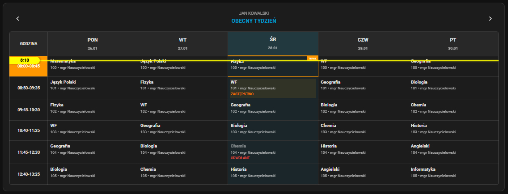
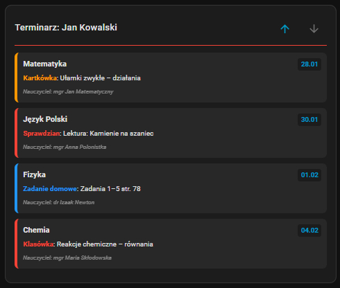
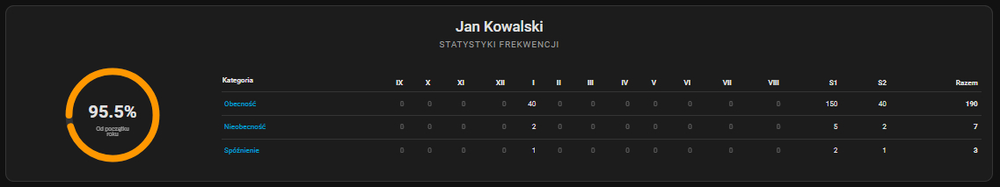
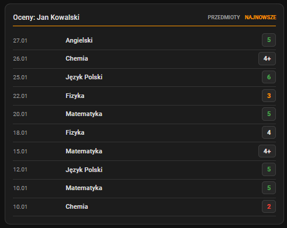
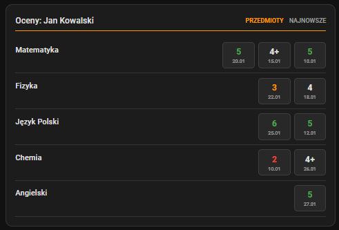
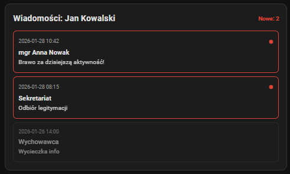
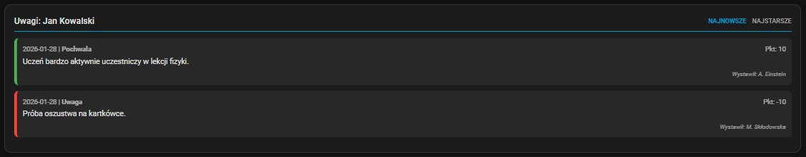
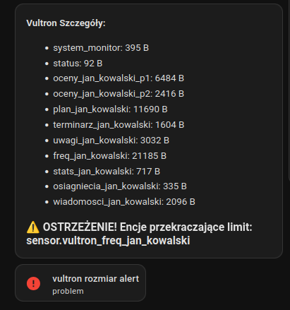

[](https://my.home-assistant.io/redirect/supervisor_add_addon_repository/?repository_url=https%3A%2F%2Fgithub.com%2Fhtomasz%2Fvultron)


[](https://github.dev/htomasz/vultron)
<p align="center">
  
<br><b>Używanie projektu jest jawnym łamaniem regulaminu EduVulcan.pl. <br>Nie rób tego.</b>
</p>

# Vultron (Furlong/fortnight)

**Vultron** to **totalnieNIEzaawansowana** integracja Home Assistant z systemem dziennika elektronicznego **EduVulcan.pl**. Dodatek został zaprojektowany, aby dostarczać rodzicom i uczniom kluczowe informacje o edukacji w sposób przejrzysty, zautomatyzowany i bezpieczny.

**Autor:** AI i Tomasz H. \
**Wersja:** 4.1 \
**Nazwa Kodowa:** Furlong/fortnight 📏 + 🗓️

# 📖 Spis treści
* [🚨 Achtung](#-achtung-achtung-)
* [🧩 Changelog](#-changelog)
* [✨ Główne Funkcje](#-główne-funkcje)
* [🏗️ Architektura Systemu](#️-architektura-systemu)
* [🚀 Instalacja](#-instalacja)
* [⚙️ Konfiguracja](#️-konfiguracja)
* [📊 Konfiguracja Kart Dashboardu](#-konfiguracja-kart-dashboardu)
* [🔄 Automatyzacja](#-automatyzacja)
* [📊 Monitoring](#-monitoring)
* [📸 Próbki/screenshoty](#-próbkiscreenshoty)
* [🪲 Zgłaszanie błędów](#-zgłaszanie-błędów-i-bezpieczeństwo)
* [🗑️ Odinstalowanie](#️-odinstalowanie)
* [⚖️ Nota prawna](#️-nota-prawna)


## 🚨🚨🚨 Achtung Achtung 🚨🚨🚨
**Przy pierwszym uruchomieniu ZALECANE śledzenie zakładki LOGI**
czy proces logowania przechodzi poprawnie.

**W razie błędów skrypt SAMOCZYNNIE zabije kontener.**

**Przed ponownym startem:**
Sprawdź ręcznie logowanie w oryginalnym dzienniku przez W W W.


## 🧩 Changelog
### **4.1 - „16KB"**
- **Oceny**
    - Podział Ocen: Rozbito oceny na dwie niezależne encje: _p1 (Okres 1) oraz _p2 (Okres 2).
    - vultron-grades-card (Oceny):
        - Dodano zakładki OKRES 1 i OKRES 2 w nagłówku.
        - Karta pozwala na płynne przełączanie widoku między semestrami.
- **Wiadomości**
    - Skrypt przesyła teraz do HA tylko 10 najnowszych wiadomości. Atrybut treść jest przesyłany wyłącznie dla wiadomości nieprzeczytanych. Wiadomości przeczytane zajmują teraz minimalną ilość miejsca (tylko meta-dane), a karta wyświetla informację o dostępie do pełnej treści w aplikacji EduVulcan.
    - vultron-messages-card:
        - Dodano licznik statystyk w nagłówku.
        - Dodano ramkę informacyjną dla wiadomości archiwalnych (bez treści).
- **Plan**
    - Redukcja Planu: Skrócono zakres planu przesyłanego do HA do 21 dni (poprzedni + obecny tydzień + następny), co pozwoliło zejść z ~20KB
    - vultron-card (Plan):
        - Zunifikowano wygląd nagłówka (Kolor Cyan #00bcd4, ikony MDI).
        - Reimplementowano znacznik "TERAZ" oraz podświetlenie aktywnej lekcji za pomocą box-shadow: inset (widoczne z każdej strony komórki).
- **Automatyzacje**
    - HA/Node_RED/Blueprints - zaktualizowano automatyzacje powiadamiania o ocenach
- **Monitoring**
    - (`vul-monitor.py`)sumuje rozmiary danych Vultron i raportuje szczegóły oraz ostrzeżenia, a alert włącza się, gdy dane encji przekroczą krytyczny limit 16 KB. Wszystkie przekroczenia progów WARNING(14000B) i CRITICAL(15500B) są logowane w konsoli [MONITOR].
    Wiecej w dziale [📊 Monitoring](#-monitoring)

### **4.0** - „Furlong/fortnight"**
- Pełna migracja na SQLite: Dane są teraz trwałe, dostępne offline w bazie vultron.db.
- Optymalizacja płynności UI: Ograniczono przesył danych do HA do obecnego i poprzedniego tygodnia, co wyeliminowało lagi w interfejsie.
- Redukcja zasobów: Znacząco zmniejszono zużycie RAM przez Chromium (blokada obrazów/GPU) oraz wprowadzono bezpieczny zapis plików.
- Najważniejsze: kolor w planie zgadza sie z resztą

### **3.4.2 - „Siriustek"**
- Dodano 5 gotowych schematów automatyzacji dla HA (Oceny, Frekwencja, Plan, Uwagi, Wiadomości).

### **3.4.1 - „Siriustek"**
- Implementacja zaawansowanego skanowania bezpieczeństwa (CodeQL, Bandit, Trivy, Hadolint).
- Dodanie mechanizmu pre-commit i automatyzacji GitHub Actions.
- Optymalizacja dokumentacji i integracja z "My Home Assistant"

### **3.2 - „Siriustek"**
- Automatyczne odświeżanie kart (Cache-busting): Koniec z ręcznym czyszczeniem ciasteczek i cache'u przeglądarki po aktualizacji dodatku. System automatycznie wersjonuje pliki .js.
- Auto-Discovery kart UI: Skrypt `setup_ui.py` sam wykrywa wszystkie pliki kart w folderze i rejestruje je w zasobach Lovelace.
- Inteligentny start: Dodano pętlę "retry" przy łączeniu z API Home Assistant. Jeśli system startuje po awarii prądu, dodatek cierpliwie poczeka, aż rdzeń HA będzie gotowy.
- Bezpieczna północ: Naprawiono błąd w skrypcie `run.sh`, który mógł powodować błędy w cyklu synchronizacji o godzinie 00:00.
- Optymalizacja obrazu: Przebudowano `Dockerfile` (czyszczenie cache apk, instalacja przez requirements.txt), co owocuje mniejszym i stabilniejszym kontenerem.
- Nowy system instalacji: Dodano obsługę przycisku "My Home Assistant" oraz uporządkowano dokumentację README.

### **3.000009 - „Muggeseggele"**
- Dodano acziwmenety :D
    - vulos.py
    - vultron-osiagniecia-card.js
    - automatyzacji do niej nie będzie - nikt nie ma tak zajebistego dziecka
- Chyba wszystko juz mamy :P
- Wszędzie będzie Glassmorphism + ban
- Koniec rozwoju (nieeee :D)

### **2.5 - „Peninkulma"**
- Dodano wyświetlanie za co ocena (po najechaniu na ocenę)
    - vulo.py - zmiany w zapisywaniu ocen
    - Dostosowano karte vultron-grades-card.js
    - Dostosowano automatyzacje Node-RED oraz HA do powiadomień o nowych ocenach
    - Dodano Glassmorphism i artretyzm

### **2.4 - „Iteru"**
- Zrefactoryzowano kod dla vulp.py oraz vulf.py
- Zmieniono days=61 w vuls.py
- Naprawiono "zielonkę kreskę" zeby nie konczyła sie na czwartku.
- Dodano natywne automatyzacje dla HA
- Poprawiono automatyzacje dla Node-RED
- Zaktualizowane karte planu o ładne owalne cosie
- Dodano awaryjne zabijanie kontenera w sytuacji ze `vul.py` logowanie do portalu nie przejdzie.

### **2.3 - „Sheppey"**
- Dodano automatyczne zabijanie kontenera w momencie gdy system wykryje ze nie moze sie zalogowac na strone.
- Czytanie treści wiadomości.
- Karta wiadomosci
    - Po kliknieciu mozna zobaczyć (oraz skopiować :D) treść wiadomosci.

### **2.2 - „Saunakalja"**
- Karta terminarz. oceny
    - Dodano limit
- Karty *.js
    - Próba ujednolicenia wyglądu
- Dokumentacja
    - Dodano zrzuty ekranów wszystkich kart.
- Automatyzacja
    - Dodano przykładowe automatyzacje w Node-Red (dział automatyzacja)

### **2.1 - „Kenno"**
- Dodano do karty planu
	- Dodano status frekwencji na danym przedmiocie w ciagu dnia (informacja pokaze sie tylko jak nauczyciel ją wprowadzi)
	- Dodano pasek pokazujacy aktualna godzine
	- Dodano inny kolor dla kolumny aktualnego dnia
- Dodano funkcje pobierania frekwencji oraz karte frekwencji lovelace
	- statystyka frekwencji od poczatku roku wraz z procentową reprezentacja

### **2.0 - „Poronkusema"**
- Dodano chyba pełna obsługę multi-kinderpunkow

### **1.2.5 - „नीलो चूहा"**
- Dodano sortowanie do kart
    - karta Oceny - sortowanie (data|subject)
    - karta Terminarz - sortowanie rosnąco, malejąco (desc,asc)
    - karta Uwagi - sortowanie rosnąco, malejąco (desc,asc)

### **1.2.4 - „Shǎbī de Tómǎsī"**
- Karta plan - dodano podział na 2 lekcje o tej samej godzinie. Grupy albo błąd eduvulcan

### **1.2.3 - „Chokochoko Mfunguo"**
- Karta plan - dodano daty do aktualnego tygodnia, oraz dane nauczycieli danego przedmiotu
- Karta oceny - dodano sortowanie
- Karta wiadomosci - dodano sortowanie oraz limit
- Karta uwagi - dodano sortowanie oraz limit

### **1.2.2 - „EKEN 4K :P”**
- Dodano podswietlanie aktywnego dnia na dzienniku
- Dodano sortowanie w zadaniach domowych/sprawdzianach

### **1.2.1 - „Tin short”**
- Dodano informacje o "zwolnieniu uczniów do domu"

### **1.2 – „Messenger Burger”**
- Dodano obsługę
    - wiadomości i licznik nieprzeczytanych.

### **1.1 – „Feedback boobs”**
- Dodano obsługę
    - uwag i pochwał

### **1.0 – „First Contact”**
- Pierwsza wersja integracji z EduVulcan.
- Dodano:
    - plan lekcji
    - oceny
    - sprawdziany i zadania

## ✨ Główne Funkcje

- 👨‍👩‍👧‍👦 **Multi-Student Support:** Automatyczne wykrywanie wszystkich(wszystkie dzieci nasze są) dzieci przypisanych do konta rodzica. Każde dziecko otrzymuje własny zestaw sensorów (np. `adam_nowak`, `jan_kowalski`).
- 📅 **Profesjonalny Plan Lekcji:** Klasyczny układ tabelaryczny z nieograniczoną nawigacją tygodniową (poprzedni / obecny / następny).
- 📈 **Monitoring Ocen:** Śledzenie ocen cząstkowych z systemem powiadomień o nowych wpisach i zmianach.
- 💬 **Uwagi i Pochwały:** Pełny wgląd w zachowanie ucznia z podziałem na wpisy pozytywne, negatywne oraz informacyjne.
- ✉️ **Centrum Wiadomości:** Licznik wiadomości nieprzeczytanych oraz odczytanych wraz z listą ostatnich nadawców i tematów.
- 🎒 **Terminarz Wydarzeń:** Podgląd sprawdzianów, kartkówek i zadań domowych z kolorystycznym rozróżnieniem priorytetów.
- ✔️ **Frekwencja:** Szczegółowe informacje o frekwencji na zajęciach.
- 🏆 **Osiągnięcia:** Szczegółowe informacje o osiągnięciach.
- 📊 **Monitoring:** Monitoring 16KB.
- 🛠️ **Zero-Click UI:** Dodatek automatycznie rejestruje wymagane karty JavaScript w zasobach Lovelace (Resources) przy każdym starcie.
- 🕵️ **System Anty-Detekcyjny:**
  - Zapytania do serwerów Vulcan wysyłane są w losowych odstępach (40-60 min).
  - **Tryb Nocny:** Całkowite wstrzymanie aktywności między 01:00 a 05:59.
- 📝 **Precyzyjne Logowanie:** Wszystkie zdarzenia logowane są z timestampem w formacie `[YYYY-MM-DD HH:MM:SS]`.


## 🏗️ Architektura Systemu

System opiera się na modularnej strukturze współpracujących skryptów:

| Moduł | Rola | Opis techniczny |
| :--- | :--- | :--- |
| `vul.py` | 🔑 **Logowanie** | Silnik **Selenium Headless**. Obsługuje logowanie, akceptację cookies (iframe) oraz ekstrakcję unikalnych kluczy sesji (`app_key`) bezpośrednio z nowego Panelu Rodzica. |
| `vul-for-mess.py` |  🔑 **Logowanie** | Silnik **Selenium Headless**. Obsługuje logowanie do panelu Wiadomosci |
| `vulo.py` | 📝 **Oceny** | Pobiera oceny i zarządza bazą **SQLite** (`vultron.db`), porównując stany w celu wykrycia nowych ocen. |
| `vuluw.py` | 💬 **Uwagi** | Pobiera uwagi i pochwały. Monitoruje ID wpisów, umożliwiając automatyzację powiadomień o zachowaniu. |
| `vulm.py` | ✉️ **Wiadomości** | **Wiadomości** Zlicza wiadomości przeczytane i nieprzeczytane. |
| `vulp.py` | 📅 **Plan Lekcji** | Synchronizuje plan zajęć w szerokim zakresie dat, wspierając nawigację w kartach UI. |
| `vuls.py` | 🎒 **Zadania** | Pobiera szczegółowe informacje o sprawdzianach i zadaniach domowych (detale nauczyciela, opisy). |
| `vulf.py` | ✔️ **Frekwencja** | Pobiera szczegółowe informacje o frekwencji na zajęciach. |
| `vulos.py` | 🏆 **Osiągnięcia** | Pobiera szczegółowe informacje osiągnięciach |
| `vul-monitor.py` | 📊 **Monitoring** | Zapewnia monitoring i ostrzeganie zanim limity zostaną przekroczone. |
| `setup_ui.py` | 🎨 **UI Setup** | Automatycznie dodaje karty do zasobów HA przez, eliminując konfigurację ręczną. |
| `run.sh` | ⚙️ **Orkiestrator** | Skrypt nadrzędny Bash. Zarządza pętlą czasu, kopiowaniem plików UI i anty-detekcją. |
| `vultron-card.js` | 🎨 **Stylizacja** | Karta stylizacji planu lekcji |
| `vultron-grades-card.js` | 🎨 **Stylizacja** | Karta stylizacji ocen |
| `vultron-messages-card.js` | 🎨 **Stylizacja** | Karta stylizacji wiadomości |
| `vultron-stats-card.js` | 🎨 **Stylizacja** | Karta stylizacji frekwencji |
| `vultron-osiagniecia-card.js` | 🎨 **Stylizacja** | Karta stylizacji osiągnięć |
| `vultron-uwagi-card.js` | 🎨 **Stylizacja** | Karta stylizacji uwag i pochwał |
| `vultron-work-card.js` | 🎨 **Stylizacja** | Karta stylizacji zadań domowych oraz sprawdzianów |
| `automation/node-red` | 🔄 **Automatyzacje** | Przykładowe automatyzacje w node-red |
| `automation/ha` | 🔄 **Automatyzacje** | Przykładowe natywne automatyzacje |
| `automation/blueprints` | 🔄 **Automatyzacje** | Przykładowe blueprinty automatyzacji |
| `lovelace` | 🎨 **Stylizacja** | Przykładowe karty |


## 🚀 Instalacja

Vultron jest dostępny jako standardowe repozytorium Home Assistant.

### Metoda 1: Automatyczna (Zalecana)

Kliknij poniższy przycisk, aby dodać repozytorium do swojego Home Assistanta jednym kliknięciem:

[](https://my.home-assistant.io/redirect/supervisor_add_addon_repository/?repository_url=https%3A%2F%2Fgithub.com%2Fhtomasz%2Fvultron)

Po dodaniu repozytorium, wejdź w **Ustawienia -> Dodatki -> Sklep z dodatkami**, wyszukaj **Vultron** i kliknij **Zainstaluj**.

<br>

<details>
<summary><b>Metoda 2: Ręczna / Deweloperska (SSH)</b></summary>

<br>

Jeśli wolisz zainstalować dodatek ręcznie przez konsolę:

1. Zainstaluj dodatek [SSH & Web Terminal](https://github.com/hassio-addons/addon-ssh).
2. Po instalacji wyłącz **Protection mode** oraz włącz **Show in sidebar**.
3. Wejdź w dodatek SSH i przejdź do folderu addons:
```bash
cd /addons
```
4. Sklonuj repozytorium:
```bash
git clone https://github.com/htomasz/vultron.git
```
5. W interfejsie HA przejdź do **Ustawienia -> Dodatki -> Sklep z dodatkami**, kliknij trzy kropki (prawy górny róg) i wybierz **Odśwież**.

</details>

---

## ⚙️ Konfiguracja

W zakładce **Konfiguracja** zainstalowanego dodatku wypełnij dane dostępowe:

| Parametr | Opis | Przykład |
| :--- | :--- | :--- |
| `username` | Adres e-mail do EduVulcan | `rodzic@email.pl` |
| `password` | Hasło do portalu | `TwojeTajneHasło` |

1. Kliknij **Zapisz**.
2. Kliknij **Uruchom**.

**Ważne:** Przy pierwszym uruchomieniu zalecane jest śledzenie zakładki **Logi**, aby upewnić się, że proces logowania przebiega pomyślnie. Skrypt posiada zabezpieczenie, które w razie błędnego hasła automatycznie zatrzyma kontener, chroniąc Twoje konto przed blokadą.

---

### 💡 Ważna uwaga dotycząca kart UI i odświeżania

Z powodu sposobu, w jaki Home Assistant oraz przeglądarki internetowe zarządzają plikami interfejsu (Lovelace), po instalacji dodatku lub jego aktualizacji możesz napotkać problemy z wyświetlaniem kart (np. błąd `Custom element doesn't exist` lub brak nowych funkcji).

Oto jak sobie z tym poradzić:

#### 1. "Zwykłe" Odświeżanie vs "Twarde" Odświeżanie
Przeglądarki często przechowują starą wersję plików `.js`, aby przyspieszyć ładowanie strony. Jeśli karta nie wygląda tak, jak powinna:
*   **Na komputerze:** Użyj kombinacji **`Ctrl + F5`** (Windows/Linux) lub **`Cmd + Shift + R`** (Mac). Wymusza to na przeglądarce ponowne pobranie plików z serwera Home Assistant zamiast czytania ich z dysku.
*   **W aplikacji mobilnej:** Zamknij całkowicie aplikację Home Assistant i uruchom ją ponownie. Możesz również wejść w *Ustawienia -> Aplikacja towarzysząca -> Debugowanie -> Wyczyść pamięć podręczną*.

#### 2. Kiedy wyczyścić ciasteczka i dane strony?
Jeśli "Twarde odświeżanie" nie pomaga, może to oznaczać, że w pamięci podręcznej przeglądarki utknął błędny stan zasobów.
*   W takim przypadku zalecane jest wyczyszczenie danych podręcznych dla adresu IP/domeny Twojego Home Assistanta.
*   **Wskazówka:** Często najszybszym testem jest otwarcie panelu w **trybie Inkognito**. Jeśli tam karty działają poprawnie, oznacza to, że Twoja główna sesja przeglądarki wymaga czyszczenia cache.

#### 3. Rejestracja Zasobów
Mimo że dodatek posiada moduł `setup_ui.py`, który automatycznie dodaje karty do zasobów, Home Assistant czasami potrzebuje chwili (lub restartu interfejsu), aby "zauważyć" nową ścieżkę `/local/vultron/vultron-*.js`. Jeśli po instalacji nie widzisz kart, przejdź do:
`Ustawienia -> Pulpity sterujące -> Trzy kropki -> Zasoby`
i upewnij się, że wpisy dla Vultrona są obecne na liście.


## 📊 Konfiguracja Kart Dashboardu

Po uruchomieniu dodatku sensory zostaną utworzone automatycznie (np. `sensor.vultron_oceny_jan_kowalski`). Dodaj nową kartę (Manual Card) na swoim Dashboardzie, korzystając z poniższych wzorów:

### 📅 Plan Lekcji (Tabelaryczny z nawigacją)
```yaml
type: custom:vultron-card
entity: sensor.vultron_plan_jan_kowalski
freq_entity: sensor.vultron_freq_jan_kowalski
```

### 📈 Oceny Cząstkowe
```yaml
type: custom:vultron-grades-card
entity: sensor.vultron_oceny_jan_kowalski
default_sort: date or subject
limit: 10   #0 - pokazuje wszystkie
```

### ✉️ Wiadomości (Licznik i Lista)
```yaml
type: custom:vultron-messages-card
entity: sensor.vultron_wiadomosci_jan_kowalski
limit: 10   #0 - pokazuje wszystkie
```

### 💬 Uwagi i Pochwały
```yaml
type: custom:vultron-uwagi-card
entity: sensor.vultron_uwagi_jan_kowalski
default_sort: desc or asc
limit: 10   #0 - pokazuje wszystkie
```

### 🎒 Terminarz (Sprawdziany i Zadania)
```yaml
type: custom:vultron-work-card
entity: sensor.vultron_terminarz_jan_kowalski
default_sort: desc or asc
limit: 10   #0 - pokazuje wszystkie
```

### ✔️  Frekwencja
```yaml
type: custom:vultron-stats-card
entity: sensor.vultron_stats_jan_kowalski
```

### 🏆 Osiągnięcia
```yaml
type: custom:vultron-osiagniecia-card
entity: sensor.vultron_osiagniecia_jan_kowalski
```
mozna też użyć
```yaml
- type: gauge
  entity: sensor.vultron_stats_jan_kowalski
  min: 0
  max: 100
  name: Frekwencja Jan Kowalski
  needle: true
  severity:
    green: 80
    yellow: 50
    red: 0
```
## 📊 Monitoring
Oblicza sumaryczny rozmiar atrybutów wszystkich encji sensor.vultron_* w Home Assistant (w bajtach). Tworzy szczegółowy raport z rozmiarem każdej encji. Generuje listę ostrzeżeń dla encji przekraczających próg ostrzegawczy (14 000 B). Cel: wczesne wykrycie dużych encji, które mogą spowolnić HA lub przekroczyć limity ~16 kB. Sensory tworzone automatycznie i automatycznie aktualizowane.

```yaml
sensor.vultron_system_monitor
binary_sensor.vultron_rozmiar_alert
```
Aby zwizualizować wartosci monitoringu uzyj karty markdown dla sensor.vultron_system_monitor
```yaml
type: markdown
content: >
  **Vultron Szczegóły:**  
    
    - {{ item }}
    
  
    Oczekiwanie na dane...
  
   ### ⚠️
  OSTRZEŻENIE! Encje przekraczające limit: {{
  state_attr('sensor.vultron_system_monitor', 'ostrzezenia') }} 
```
aby zwizualizowac alarm uzyj karty encji dla binary_sensor.vultron_rozmiar_alert
```yaml
type: tile
entity: binary_sensor.vultron_rozmiar_alert
vertical: false
features_position: bottom
```

## 🔄 Automatyzacja

IMPLEMENTUJ PO TYM JAK DODATEK WYKONA CAŁY JEDEN CYKL bo inaczej wszystko bedzie powiadomieniem.

### 🔄 Automatyzacje (Blueprints)

Zapomnij o ręcznym kopiowaniu kodu YAML. Dzięki **Blueprints (Schematom)** możesz skonfigurować powiadomienia o ocenach, nieobecnościach czy wiadomościach w kilka sekund za pomocą prostego interfejsu graficznego.

#### 🎓 Jak używać?
1. Kliknij przycisk **Importuj** przy wybranym schemacie.
2. Zatwierdź import w swojej instancji Home Assistant.
3. Wybierz odpowiedni sensor Twojego dziecka (np. `sensor.vultron_oceny_jan_kowalski`).
4. Wybierz telefon, na który mają przychodzić powiadomienia, i kliknij **Zapisz**.

---

#### 📦 Vultron Alert Pack

| Funkcja | Opis | Import |
| :--- | :--- | :---: |
| **Nowe Oceny** | Zaawansowane powiadomienia o ocenach (obsługuje wiele ocen naraz). | [](https://my.home-assistant.io/redirect/blueprint_import/?blueprint_url=https%3A%2F%2Fgithub.com%2Fhtomasz%2Fvultron%2Fblob%2Fmain%2Fautomation%2Fblueprints%2Foceny.yaml) |
| **Frekwencja** | Alert o nieobecnościach i spóźnieniach z nazwą przedmiotu z planu. | [](https://my.home-assistant.io/redirect/blueprint_import/?blueprint_url=https%3A%2F%2Fgithub.com%2Fhtomasz%2Fvultron%2Fblob%2Fmain%2Fautomation%2Fblueprints%2Ffrekwencja.yaml) |
| **Zmiana Planu** | Powiadomienia o zastępstwach, odwołanych lekcjach i przeniesieniach. | [](https://my.home-assistant.io/redirect/blueprint_import/?blueprint_url=https%3A%2F%2Fgithub.com%2Fhtomasz%2Fvultron%2Fblob%2Fmain%2Fautomation%2Fblueprints%2Fplan.yaml) |
| **Uwagi i Pochwały** | Informacja o zachowaniu dziecka z automatycznym doborem emoji (`🌟`/`⚠️`). | [](https://my.home-assistant.io/redirect/blueprint_import/?blueprint_url=https%3A%2F%2Fgithub.com%2Fhtomasz%2Fvultron%2Fblob%2Fmain%2Fautomation%2Fblueprints%2Fuwagi.yaml) |
| **Wiadomości** | Powiadomienie o nowej wiadomości od nauczyciela lub dyrekcji. | [](https://my.home-assistant.io/redirect/blueprint_import/?blueprint_url=https%3A%2F%2Fgithub.com%2Fhtomasz%2Fvultron%2Fblob%2Fmain%2Fautomation%2Fblueprints%2Fwiadomosci.yaml) |

---

#### 💡 Personalizacja powiadomień
W sekcji **Akcje** każdego Blueprintf-a możesz używać dynamicznych zmiennych, aby dostosować treść powiadomienia:

*   **Oceny:** `{{ uczen }}`, `{{ przedmiot }}`, `{{ ocena }}`, `{{ opis }}`, `{{ data }}`
*   **Frekwencja:** `{{ uczen }}`, `{{ wiadomosc }}`
*   **Zmiana Planu:** `{{ uczen }}`, `{{ wiadomosc }}`
*   **Uwagi:** `{{ uczen }}`, `{{ kategoria }}`, `{{ tresc }}`, `{{ autor }}`, `{{ wiadomosc }}`
*   **Wiadomości:** `{{ uczen }}`, `{{ nadawca }}`, `{{ temat }}`, `{{ wiadomosc }}`

*Przykład wiadomości:* `{{ uczen }} otrzymał ocenę {{ ocena }} z przedmiotu {{ przedmiot }}!`

### 🛑 Node-RED

Do działania wymagany jest [node-red-contrib-home-assistant-websocket](https://flows.nodered.org/node/node-red-contrib-home-assistant-websocket) dla Node-RED. (najprościej zainstalowac poprzez manage-palette)

Ponizsze automatyzacje instaluje się poprzez import i wklej :D

W plikach

- [plan.json](./automation/node-red/plan.json#L12-L16) - powiadomienia o zmianach w planie
- [frekwencja.json](./automation/node-red/frekwencja.json#L12-L16) - powiadomienia o zmianach we frekwencji
- [oceny.json](./automation/node-red/oceny.json#L12-L16) - powiadomienia o zmianach w ocenach
- [terminarz.json](./automation/node-red/terminarz.json#L12-L16) - powiadomienia o zmianach w zdaniach domowych/sprawdzianach
- [uwagi.json](./automation/node-red/uwagi.json#L12-L16) - powiadomienia o zmianach w uwagach
- [wiadomosc.json](./automation/node-red/wiadomosci.json#L12-L16) - powiadomienia o nowych wiadomościach
- [patusek.json](./automation/node-red/patusek.json#L12-L16) - wyjscie do "odłącz prąd i zablokuj MAC" :D

odszukaj sekcję `entities` i zmień nazwę sensora.

```json
...
[
    {
        "id": "vultron_plan_trigger",
        "type": "server-state-changed",
        "z": "vultron_grades_flow",
        "name": "Zmiana w Planie",
        "server": "a8398b8a.edbcf8",
        "version": 6,
        "outputs": 1,
        "exposeAsEntityConfig": "",
        "entities": {
            "entity": [
                "sensor.vultron_plan_jan_kowalski" <-- TU WPISZ SWOJĄ ENCJE
            ],
            "substring": [],
            "regex": []
        },
...
```

### 🏠 HA Automations

Najprosciej dodać:

Ustawienia -> Automatyzacje oraz sceny -> Utwórz automatyzację  -> Utwórz nową automatyzację -> ⋮ -> Edycja w YAML -> Wklej i zmien "entity"

- [plan.yaml](./automation/ha/plan.yaml#L12-L16) - powiadomienia o zmianach w planie
- [frekwencja.yaml](./automation/ha/frekwencja.yaml#L12-L16) - powiadomienia o zmianach we frekwencji
- [oceny.yaml](./automation/ha/oceny.yaml#L12-L16) - powiadomienia o zmianach w ocenach
- [uwagi.yaml](./automation/ha/uwagi.yaml#L12-L16) - powiadomienia o zmianach w uwagach
- [wiadomosc.yaml](./automation/ha/wiadomosci.yaml#L12-L16) - powiadomienia o nowych wiadomościach


```yaml
...
alias: "Vultron: Alert Frekwencji"
description: ""
triggers:
  - entity_id:
      - sensor.vultron_freq_jan_kowalski <-- TU WPISZ SWOJĄ ENCJE
    attribute: wpisy
    trigger: state
actions:
...
```


## 📸 Próbki/screenshoty

#### 📚 Plan lekcji


#### 📅 Terminarz


#### 📊 Frekwencja


#### 📝 Oceny
 

#### 💬 Wiadomości


#### ⚠️ Uwagi


#### 📊 Monitoring


## ⚠️ Debugowanie
Jeśli napotkasz problemy z logowaniem:
1. Sprawdź zakładkę **Logi** dodatku. Wszystkie błędy są tam opisywane w czasie rzeczywistym.

## 🪲 Zgłaszanie błędów i Bezpieczeństwo

Znalazłeś błąd lub masz pomysł na nową funkcję? Postępuj zgodnie z poniższymi krokami:

1. **Błędy bezpieczeństwa (Security):** Jeśli znalazłeś lukę dotyczącą haseł, sesji, wycieku danych lub prywatności, **NIE OTWIERAJ** publicznego zgłoszenia w Issues. Przeczytaj naszą politykę [🛡️ SECURITY.md](https://github.com/htomasz/vultron/blob/main/SECURITY.md) i postępuj zgodnie z zawartą tam instrukcją prywatnego zgłoszenia.

2. **Błędy techniczne (Bugs):** Jeśli błąd nie dotyczy bezpieczeństwa (np. błąd w planie lekcji, błąd w karcie UI):
   - Sprawdź, czy problem nie został już zgłoszony w [GitHub Issues](https://github.com/htomasz/vultron/issues).
   - Jeśli nie, otwórz nowe zgłoszenie [tutaj](https://github.com/htomasz/vultron/issues).

3. **Sugestie (Features):** Masz pomysł na nową funkcję? Otwórz zgłoszenie typu "Feature Request" w zakładce Issues.

## 🗑️ Odinstalowanie
Jeśli zdecydujesz się usunąć dodatek:
1. Odinstaluj Vultron w zakładce Dodatki.
2. Ręcznie usuń folder `/config/www/vultron`.
3. Usuń wpisy kart (filtr po vultron_) w `Ustawienia -> Pulpity sterujące -> Zasoby`

## ⚖️ Nota prawna
> [!IMPORTANT]
> Projekt **Vultron** jest narzędziem edukacyjnym i służy TYLKO wyłącznie do użytku prywatnego. Autor nie bierze odpowiedzialności za ewentualne blokady kont, błędy w synchronizacji danych czy inne konsekwencje wynikające z automatyzacji dostępu do portalu EduVulcan.pl. Korzystasz z dodatku na własną odpowiedzialność.

## 🏚️️ Łamanie prawa
> [!IMPORTANT]
> Używanie projektu jest jawnym łamaniem regulaminu EduVulcan.pl. Nie rób tego.
